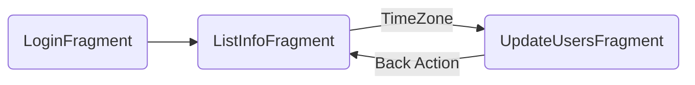

Android Homework
================
A homework application using MVVM Architecture.

UI Navigation:

```mermaid
graph LR
frag_lg(LoginFragment)
frag_li(ListInfoFragment)
frag_uu(UpdateUsersFragment)

frag_lg-->frag_li;
frag_li--TimeZone-->frag_uu;
frag_uu--Back Action-->frag_li;
```

Application architecture:

```mermaid
graph TB;
    %% Logig
    frag_login(LoginFragment)
    vm_ac(AccountViewModel)
    rp_ac(AccountRepository)
    ds_ac([AccountRemoteDatasource])
    
    %% List Information(News)
    frag_list(ListInfoFragment)
    vm_list(ListInfoViewModel)
    rp_news(NewsRepository)
    ds_news([NewsRemoteDataSource])
    
    %% Update time zone of users
    frag_uu(UpdateUsersFragment)

    lc_data[(LocalDataSource)]
    
    %% MVVM
    id_view(Activity/Fragment)
    id_viewmodel(ViewModel)
    id_repository(Repository)
    id_model[(Model)]
    id_remote([Remote Data Source])
    
    %% Api
    serv_news[[NewsService]]
    serv_account[[AccountService]]

    subgraph News
    frag_list-->vm_list;
    vm_list-->rp_news;
    rp_news-->ds_news;
    ds_news--Retrofit-->serv_news;
    end
    
    subgraph Account
    frag_login-->vm_ac;
    frag_uu-->vm_ac;
    vm_ac-->rp_ac;
    rp_ac-->lc_data;
    rp_ac-->ds_ac;
    ds_ac--Retrofit-->serv_account;
    end
    
    subgraph MVVM Architecture
    id_view-->id_viewmodel;
    id_viewmodel-->id_repository;
    id_repository-->id_model;
    id_repository-->id_remote;
    end
    
```